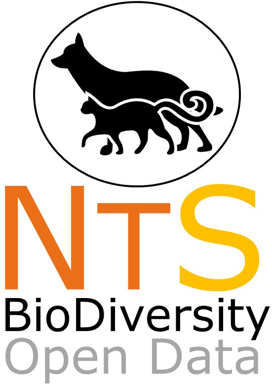

# NEOTROPICAL SERIES: Data on the biodiversity within Neotropics
--------------------------------------------------------
### ***NEOTROPICAL ALIEN MAMMALS: a dataset of occurrence and abundance of alien mammals in Neotropics***

In this ongoing datapaper we aims to compite all sort of alien mammals (exotic or native) which actually occurs in Neotropical region. We already finished the data compiling phase, and now we are consolidating the dataset. 

If you have interest on this initiative stay in touch with the Neotropical Invasive Mammals Core Team:

- <a href="mailto:alvesrosa_c@hotmail.com?subject=NeoInvMam">Clarissa Rosa</a>
- <a href="mailto:vanesa.bejarano@gmail.com?subject=NeoInvMam">Vanessa Vejarano</a>
- <a href="mailto:ribeiro.brr@gmail.com?subject=NeoInvMam">Bruno Ribeiro</a>
- <a href="mailto:fernandohpgoncalves@gmail.com?subject=NeoInvMam">Fernando Puertas</a>
- <a href="mailto:miltinho.astronauta@gmail.com?subject=NeoInvMam">Miltinho Astronauta</a>
- ​
##Submission of manuscript scheduled to May 2018
