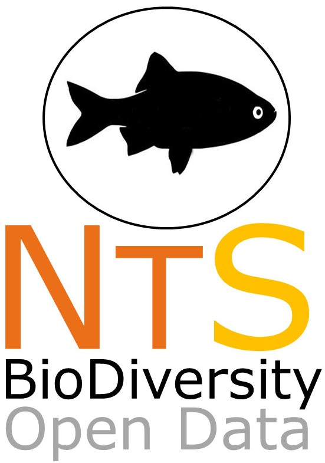

# NEOTROPICAL SERIES: Data on the biodiversity within Neotropics
--------------------------------------------------------
### ***NEOTROPICAL FRESHWATER FISHES: a dataset of occurrence and abundance of freshwater fishes in Neotropics***

In this datapaper we will collect all the available data on freshwater fishes that occurs in Neotropics. We have great interest on both published and unpublished data. If you want to join us and become a coauthor on a ECOLOGY paper, write to us:

Lívia Tonella [livia.tonella@gmail.com], Oscar Vitorino [jr.vitorino@gmail.com], Renata Ruaro [renataruaro_@hotmail.com],  Diego Garcia [diegoazgarcia@hotmail.com], Vanessa Daga [vanedaga@yahoo.com.br], Paula Anunciação [[paulaevel@yahoo.com.br](mailto:paulaevel@yahoo.com.br)], Tatiana Lobato de Magalhães [tatilobato@gmail.com], and Milton Ribeiro [miltinho.astronauta@gmail.com]

##Data collectint will start on April 2018, and the submission is scheduled to August 2018

