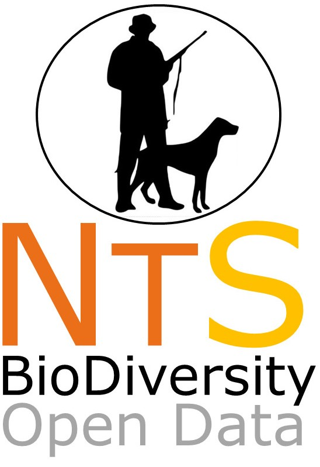

# NEOTROPICAL SERIES: Data on the biodiversity within Neotropics
--------------------------------------------------------
### ***NEOTROPICAL HUNTERS AND DOGS: a dataset of occurrence and abundance of hunterse/poachers and domestic dogs in Neotropics***

This datapaper will be dedicated to incorporate data on human and hunting activities on Neotropical regions. All type of data on hunting on natural and anthropogenic areas are very welcome. We are just starting this datapaper data collection, and we plan to submit this by July 2018. 

This compilation will be coordinated by Miriam Perilli/Instituto Pró-Carnívoros, Ana Maria Paschoal/UFMG, Cristiano Trinca/USP, Gabriela Duarte/UFMG, Gastón Giné/UFJF, Mauro Galetti/UNESP-Rio Claro and Milton Ribeiro/UNESP-Rio Claro [miriamperilli@gmail.com, anamuzenza@gmail.com, cristiano.trinca@gmail.com , [gabi.neohed@gmail.com](mailto:gabi.neohed@gmail.com), gastongine10@gmail.com, miltinho.astronauta@gmail.com].****

##Data collecting starts on April 2018, and the submission is scheduled to July 2018

