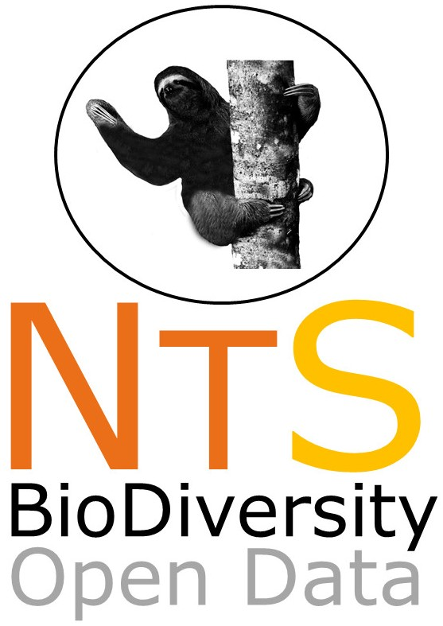
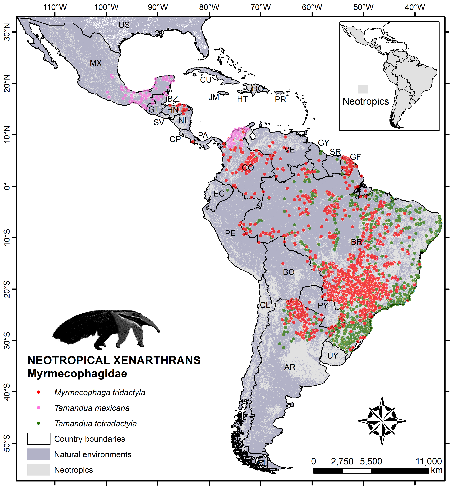

# NEOTROPICAL SERIES: Data on the biodiversity within Neotropics
--------------------------------------------------------
### ***NEOTROPICAL XENARTHRAS: a dataset of occurrence and abundance of xenarthras in Neotropics***

We compiled data on the occurence and abundance of armadillos, anteaters and sloth species that occurs in the Neotropics. Data are organized by families: Euphractinae (n=8 species), Tolypeutinae (8), Dasypodinae (8), Myrmecophagidae (3), Bradypodidae (3), and Megalonichidae (2). Regarding Cyclopedidae, until recently only a species was known, but with the genetic studies revealed that the group is represented by several species.  

We already finished data compilation, and now we are writting the manuscript, which will be submited to Ecology. If you have interest on this initiative stay in touch with us: <a href="mailto:paloma.marquessa@yahoo.com.br?subject=NeoXen">Paloma Santos</a> or<a href="mailto:miltinho_astronauta@gmail.com?subject=NeoInvMam"> Miltinho Astronauta</a>.

##Submission of manuscript scheduled to May 2018

