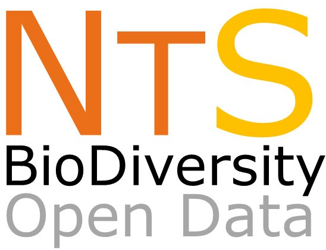

# NEOTROPICAL SERIES: Data on the biodiversity within Neotropics
--------------------------------------------------------
### ***The NEOTROPICAL SERIES aims to make public Biodiversity data for species occurrence, populantion and community levels that occurs in the Neotropical Region***

Neotropics is the regions that encompass Mexico, Central America, and almost the entire South America. In this datapaper series we aims to compile all sort of biodivesrity data, from invertebrates to vertebrates, plants, and several ecological processes. 

Join us in this Jorney. 

All data will be available in ECOLOGY repository. This mirror GITHUB repository will maintain updated versions of dataset.

**Mauro Galetti and Milton Cezar Ribeiro**

Coordinators ofthe Atlantic data papers

Universidade Estadual Paulista (UNESP)

Instituto de Biociências, Departamento de Ecologia

13506-900 Rio Claro, São Paulo, Brazil

